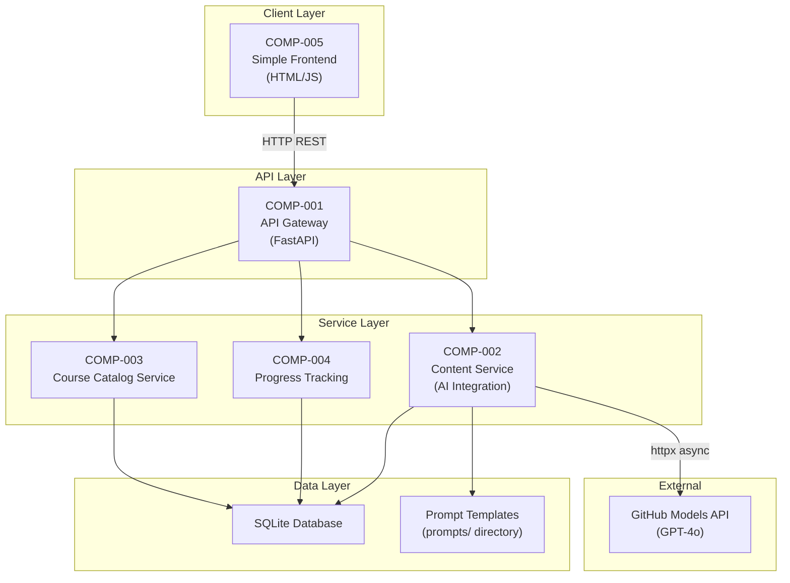
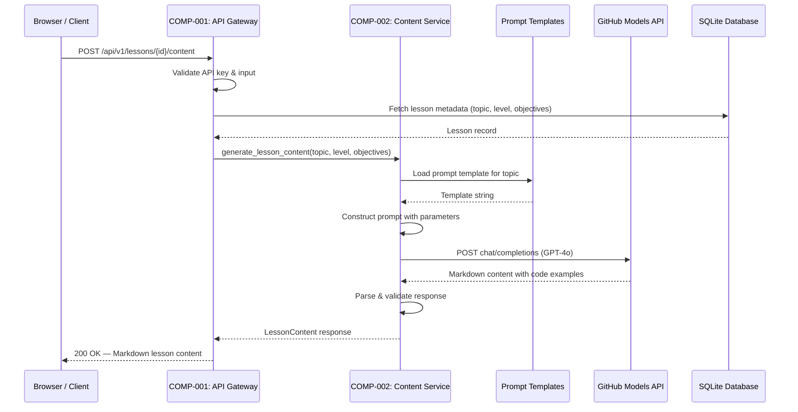
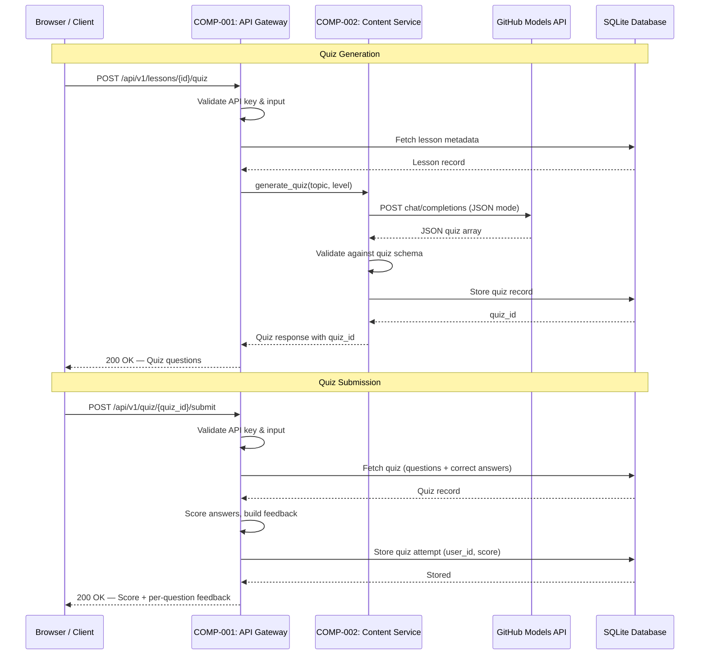
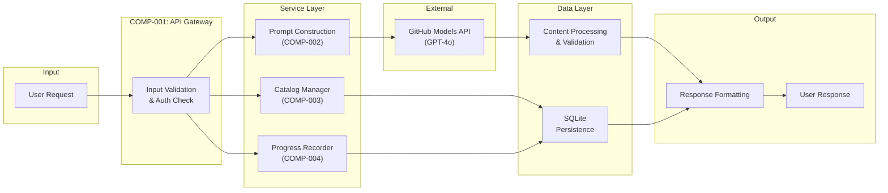

# High-Level Design (HLD)

| Field              | Value                                                      |
|--------------------|------------------------------------------------------------|
| **Title**          | AI-Powered Learning Platform — High-Level Design           |
| **Version**        | 1.0                                                        |
| **Date**           | 2026-03-24                                                 |
| **Author**         | plan-and-design-agent                                      |
| **BRD Reference**  | docs/requirements/BRD.md v1.0                              |

---

## 1. Design Overview & Goals

### 1.1 Purpose

This HLD describes the architecture of an AI-powered learning platform built with Python, FastAPI, and the GitHub Models API (GPT-4o). The platform dynamically generates lesson content, runnable code examples, and knowledge-assessment quizzes for three training topics: **GitHub Actions**, **GitHub Copilot**, and **GitHub Advanced Security**. It targets MVP delivery in a local development environment.

### 1.2 Design Goals

- **Simplicity**: Keep the architecture simple and suitable for a single-developer MVP; avoid premature abstraction.
- **Separation of Concerns**: Ensure clean separation between the API gateway, AI integration layer, course catalog, progress tracking, and data persistence.
- **Extensibility**: Make it easy to add new training topics or skill levels without architectural changes — new topics require only new seed data and prompt templates.
- **Resilience**: Gracefully handle GitHub Models API failures with retry logic and structured error responses so the platform remains usable for non-AI features.
- **Testability**: Structure the codebase so that every layer can be tested independently with mocked dependencies.

### 1.3 Design Constraints

- **Local-only deployment**: The MVP runs on a developer's machine; no cloud infrastructure, load balancing, or horizontal scaling (C-5).
- **GitHub Models API only**: All AI inference must use the GitHub Models API exclusively — no alternative LLM providers (C-1).
- **Python + FastAPI**: The backend must be implemented in Python using the FastAPI framework (C-2).
- **SQLite persistence**: Data storage must use SQLite with no external database services (C-3).
- **Environment-based secrets**: The API key must be read from the `GITHUB_MODELS_API_KEY` environment variable — never hardcoded (C-4).

---

## 2. Architecture Diagram



---

## 3. System Components

| Component ID | Name                    | Description                                                                                                   | Technology                     | BRD Requirements                                                                 |
|--------------|-------------------------|---------------------------------------------------------------------------------------------------------------|--------------------------------|----------------------------------------------------------------------------------|
| COMP-001     | API Gateway             | FastAPI application entry point handling routing, request validation, CORS, API key authentication, and error formatting. | FastAPI, Pydantic v2, Uvicorn  | BRD-FR-001 – BRD-FR-009, BRD-FR-012 – BRD-FR-014, BRD-NFR-001, BRD-NFR-004, BRD-NFR-007, BRD-NFR-009 |
| COMP-002     | Content Service         | GitHub Models API integration module responsible for prompt management, AI-powered lesson content generation, quiz generation, response parsing, and retry logic. | httpx, Pydantic v2, GPT-4o    | BRD-FR-004, BRD-FR-005, BRD-FR-015, BRD-AI-001 – BRD-AI-010, BRD-NFR-002, BRD-NFR-005, BRD-NFR-008 |
| COMP-003     | Course Catalog Service  | Manages course and lesson metadata, provides catalog browsing, handles database seeding of the three training topics at startup. | Pydantic v2, aiosqlite         | BRD-FR-001, BRD-FR-002, BRD-FR-003, BRD-FR-010, BRD-FR-014, BRD-NFR-001        |
| COMP-004     | Progress Tracking       | Persists user progress, records lesson completions, stores quiz scores, and computes per-course completion percentages. | Pydantic v2, aiosqlite         | BRD-FR-006, BRD-FR-007, BRD-FR-008, BRD-FR-011, BRD-NFR-006, BRD-NFR-012       |
| COMP-005     | Simple Frontend         | Lightweight HTML/JS single-page application for browsing courses, viewing AI-generated lesson content, taking quizzes, and viewing progress. | HTML5, Vanilla JS, CSS         | BRD-FR-001, BRD-FR-002, BRD-FR-004, BRD-FR-005, BRD-FR-007                      |

---

## 4. Component Interactions

### 4.1 Communication Patterns

- **Client ↔ API Gateway**: HTTP REST calls over `localhost`. The frontend makes `fetch()` requests to `/api/v1/` endpoints. CORS is configured to allow same-origin requests.
- **API Gateway ↔ Services**: Direct Python function calls. The API Gateway imports service modules and invokes their async methods via FastAPI dependency injection.
- **Content Service ↔ GitHub Models API**: Outbound HTTPS calls via `httpx.AsyncClient`. The Content Service constructs prompts from templates and sends chat-completion requests to the GitHub Models endpoint.
- **Services ↔ SQLite**: Async database access via `aiosqlite`. Services use a repository pattern that accepts a database connection injected by the API Gateway.

### 4.2 Lesson Content Generation Sequence



### 4.3 Quiz Generation & Submission Sequence



---

## 5. Data Flow Overview

### 5.1 Primary Data Flows

1. **Catalog Browsing**: Client → API Gateway → Course Catalog Service → SQLite → Client. Pure data retrieval with no AI involvement.
2. **Lesson Content Generation**: Client → API Gateway → Content Service → (Prompt Templates + GitHub Models API) → Client. AI-generated Markdown content streamed back as a single response.
3. **Quiz Lifecycle**: Client → API Gateway → Content Service → GitHub Models API → SQLite (store quiz) → Client (questions). Then: Client → API Gateway → SQLite (score & persist) → Client (results).
4. **Progress Tracking**: Client → API Gateway → Progress Tracking → SQLite → Client. Read and write user completion records and quiz scores.

### 5.2 Data Flow Diagram



---

## 6. GitHub Models API Integration Design

### 6.1 Integration Approach

A dedicated **Content Service** module (`COMP-002`) encapsulates all interactions with the GitHub Models API. No other component communicates with the external AI API directly. The service uses `httpx.AsyncClient` for non-blocking HTTP requests, constructs prompts from file-based templates stored in `prompts/`, and validates all AI responses before returning them to the API layer.

Key principles:
- **Single point of integration**: Only `COMP-002` knows about the GitHub Models API.
- **Prompt templates as files**: Stored in `prompts/` directory, version-controlled, parameterised with `{topic}`, `{level}`, and `{objectives}` placeholders (BRD-AI-005, BRD-AI-010).
- **Strict response validation**: Quiz JSON is validated against a Pydantic schema; malformed responses trigger up to 2 retries (BRD-AI-003).
- **30-second request timeout**: Prevents hung connections (BRD-AI-009).

### 6.2 API Usage Patterns

| Pattern                   | Description                                                                                                  | Endpoint / Model          |
|---------------------------|--------------------------------------------------------------------------------------------------------------|---------------------------|
| Lesson Content Generation | Sends a system prompt + user prompt with topic, level, and objectives. Expects Markdown with code blocks.    | GPT-4o via GitHub Models  |
| Quiz Generation           | Sends a system prompt requesting JSON output of 3-5 multiple-choice questions with options and explanations. | GPT-4o via GitHub Models  |

### 6.3 Prompt Management

- Prompt templates are stored as plain-text files in the `prompts/` directory (BRD-AI-005).
- Two template types: `lesson_content.txt` and `quiz_generation.txt`.
- Templates use Python `str.format()` placeholders: `{topic}`, `{level}`, `{objectives}`.
- Each template includes a **system message** (role/constraints) and a **user message** (specific request).
- Templates are loaded once at service startup and cached in memory.
- Future iterations can support per-topic template overrides (e.g., `prompts/actions_lesson.txt`).

### 6.4 Error Handling & Resilience

| Scenario                        | Handling Strategy                                                                                       | BRD Reference |
|---------------------------------|---------------------------------------------------------------------------------------------------------|---------------|
| HTTP 429 (Rate Limit)           | Exponential backoff with jitter. Initial delay: 1s, max retries: 3, max delay: 30s, jitter: ±500ms.   | BRD-AI-004    |
| HTTP 5xx (Server Error)         | Return HTTP 503 to client with `error_code`, `message`, and `retry_after` fields.                      | BRD-AI-006    |
| Request Timeout (30s)           | Treated as equivalent to a 5xx error; same 503 response path.                                          | BRD-AI-009    |
| Network Unreachable             | Caught as `httpx.ConnectError`; returns HTTP 503 with descriptive message.                             | BRD-AI-006    |
| Malformed AI Response (Quiz)    | Validate against Pydantic schema; retry up to 2 times before returning HTTP 502 error.                 | BRD-AI-003    |
| Malformed AI Response (Lesson)  | If content is empty or lacks code blocks, retry once; otherwise return best-effort content.             | BRD-AI-007    |

---

## 7. Technology Stack

| Layer            | Technology                | Version / Notes                    | Rationale                                                                                          |
|------------------|---------------------------|------------------------------------|----------------------------------------------------------------------------------------------------|
| Language         | Python                    | 3.11+                              | Required by project conventions; strong async support and rich ecosystem for AI/web development.    |
| Web Framework    | FastAPI                   | 0.110+                             | High-performance async framework with built-in Pydantic validation and OpenAPI docs (C-2).         |
| ASGI Server      | Uvicorn                   | 0.29+                              | Lightweight, fast ASGI server recommended for FastAPI; simple `uvicorn main:app` startup.          |
| AI Integration   | GitHub Models API (GPT-4o)| GPT-4o model                       | GitHub-native inference endpoint; strong instruction-following and JSON output reliability (C-1).   |
| HTTP Client      | httpx                     | 0.27+                              | Modern async HTTP client with timeout and retry support; cleaner API than aiohttp.                 |
| Data Validation  | Pydantic                  | v2 (2.6+)                          | Native FastAPI integration; enforces type safety on all request/response schemas.                  |
| Data Storage     | SQLite                    | 3.35+ (bundled with Python)        | Zero-config, file-based, sufficient for MVP data volumes (C-3).                                    |
| Async DB Access  | aiosqlite                 | 0.20+                              | Provides async wrapper around SQLite for non-blocking database access in FastAPI.                  |
| Frontend         | HTML5 / Vanilla JS        | —                                  | Minimal complexity; no build step required. Serves static files from FastAPI.                       |
| Testing          | pytest + pytest-asyncio   | pytest 8+, pytest-asyncio 0.23+    | Standard Python test framework with async support; HTTPX TestClient for API tests.                 |
| Package Manager  | pip                       | 24+                                | Standard Python package manager; simple `requirements.txt` for dependency management.              |

---

## 8. Deployment Architecture

### 8.1 MVP / Local Development

The platform runs entirely on a developer's machine. A single Uvicorn process serves both the FastAPI backend and the static frontend files. SQLite persists data to a local file.

```
Developer Machine
├── Python 3.11+ virtual environment
│   ├── FastAPI application (uvicorn src.main:app)
│   ├── Content Service (outbound HTTPS to GitHub Models API)
│   └── SQLite database file (data/learning_platform.db)
├── prompts/                  ← AI prompt templates
├── src/static/               ← HTML/JS/CSS frontend
└── Environment variables:
    ├── GITHUB_MODELS_API_KEY  (required)
    ├── GITHUB_MODELS_ENDPOINT (required)
    ├── API_KEY                (required — for X-API-Key auth)
    └── DATABASE_URL           (optional — defaults to sqlite:///data/learning_platform.db)
```

**Startup sequence:**
1. Developer activates the Python virtual environment.
2. Developer sets `GITHUB_MODELS_API_KEY` and `GITHUB_MODELS_ENDPOINT` environment variables.
3. Developer runs `uvicorn src.main:app --reload --port 8000`.
4. On startup, the application initialises the SQLite database and seeds course/lesson metadata (BRD-FR-010).
5. The developer navigates to `http://localhost:8000` to access the frontend.

### 8.2 Future Deployment Considerations

- **Containerisation**: Dockerfile for consistent builds; Docker Compose for multi-service setups.
- **Database migration**: Move from SQLite to PostgreSQL for production concurrency and durability.
- **Caching**: Add Redis or in-memory cache for previously generated lesson content to reduce AI API calls.
- **Cloud hosting**: Deploy to Azure App Service or AWS ECS with environment-based configuration.
- **CI/CD**: GitHub Actions workflow for automated testing, building, and deployment.

---

## 9. Security Considerations

| Area                          | Approach                                                                                                                                                     |
|-------------------------------|--------------------------------------------------------------------------------------------------------------------------------------------------------------|
| API Key Management            | `GITHUB_MODELS_API_KEY` is read from environment variables only (BRD-NFR-003). Never logged, echoed, or included in API responses. The `.env` file is `.gitignore`d. |
| Endpoint Authentication       | All endpoints except `/api/v1/health` require a valid `X-API-Key` header (BRD-NFR-004). Implemented as FastAPI middleware that returns HTTP 401 for missing/invalid keys. |
| Input Validation              | All user input is validated via Pydantic models with type checking and constraints (BRD-NFR-009). Path parameters, query parameters, and request bodies are validated before processing. Invalid input returns HTTP 422 with field-level error details (BRD-FR-012). |
| Prompt Injection Prevention   | User-supplied values are sanitised before insertion into AI prompts. Prompt templates use structured system/user message boundaries to limit injection surface (R-007). |
| Data Privacy                  | Only user IDs and progress data are stored; no PII beyond an opaque user identifier. SQLite file permissions restrict access to the running process owner.    |
| Dependency Security           | Dependencies are pinned in `requirements.txt`. Regular `pip audit` checks for known vulnerabilities. Minimal dependency footprint for MVP.                   |
| Log Sanitisation              | API keys and tokens are redacted from all log output. Structured logging ensures sensitive fields are never serialised.                                       |

---

## 10. Design Decisions & Trade-offs

| Decision ID | Decision                                   | Options Considered                                                           | Chosen Option                  | Rationale                                                                                                                                    |
|-------------|--------------------------------------------|------------------------------------------------------------------------------|--------------------------------|----------------------------------------------------------------------------------------------------------------------------------------------|
| DD-001      | Database engine for MVP persistence        | a) SQLite, b) PostgreSQL, c) JSON flat files                                | SQLite                         | Zero-config, file-based, sufficient for single-user MVP. No external service dependency. Easy migration path to PostgreSQL for production (C-3). |
| DD-002      | AI HTTP client library                     | a) httpx, b) aiohttp, c) requests (sync)                                   | httpx (AsyncClient)            | Native async support, clean API, built-in timeout/retry primitives, and first-class compatibility with FastAPI's async runtime.                |
| DD-003      | Prompt storage strategy                    | a) Inline strings in code, b) External template files, c) Database-stored   | External template files (prompts/) | Version-controlled alongside code, easy to iterate without code changes, supports future A/B testing (BRD-AI-005).                           |
| DD-004      | Frontend approach                          | a) React SPA, b) Jinja2 SSR, c) Vanilla HTML/JS                            | Vanilla HTML/JS                | Minimal complexity, no build toolchain, fast iteration for MVP. The frontend is a thin client; all logic lives in the API.                    |
| DD-005      | Authentication mechanism                   | a) OAuth2/JWT, b) Simple API key header, c) No auth                         | Simple API key in X-API-Key header | Adequate for local MVP; minimal implementation overhead. OAuth2 is out of scope (Section 4.2). Health endpoint is exempt (BRD-FR-013).        |
| DD-006      | Async database access approach             | a) aiosqlite, b) SQLAlchemy async, c) Raw sqlite3 (sync)                   | aiosqlite                      | Lightweight async wrapper; avoids blocking the FastAPI event loop. SQLAlchemy adds unnecessary complexity for MVP's simple queries.            |
| DD-007      | AI response validation strategy            | a) JSON schema validation, b) Pydantic model parsing, c) Regex matching     | Pydantic model parsing         | Consistent with the rest of the codebase. Automatic type coercion, clear error messages, and reusable as API response models (BRD-AI-003).   |
| DD-008      | Project module structure                   | a) Flat module layout, b) Domain-driven package structure                   | Domain-driven packages         | Separate packages for routes, services, models, and AI integration. Aligns with maintainability requirement (BRD-NFR-010).                   |

---

## 11. Traceability Matrix

| HLD Component | BRD Functional Reqs                                                          | BRD Non-Functional Reqs                              | BRD AI Reqs                                                    |
|---------------|------------------------------------------------------------------------------|------------------------------------------------------|----------------------------------------------------------------|
| COMP-001      | BRD-FR-001, BRD-FR-002, BRD-FR-003, BRD-FR-004, BRD-FR-005, BRD-FR-006, BRD-FR-007, BRD-FR-008, BRD-FR-009, BRD-FR-012, BRD-FR-013, BRD-FR-014 | BRD-NFR-001, BRD-NFR-004, BRD-NFR-007, BRD-NFR-009  | —                                                              |
| COMP-002      | BRD-FR-004, BRD-FR-005, BRD-FR-015                                          | BRD-NFR-002, BRD-NFR-005, BRD-NFR-008               | BRD-AI-001, BRD-AI-002, BRD-AI-003, BRD-AI-004, BRD-AI-005, BRD-AI-006, BRD-AI-007, BRD-AI-008, BRD-AI-009, BRD-AI-010 |
| COMP-003      | BRD-FR-001, BRD-FR-002, BRD-FR-003, BRD-FR-010, BRD-FR-014                 | BRD-NFR-001, BRD-NFR-010                             | —                                                              |
| COMP-004      | BRD-FR-006, BRD-FR-007, BRD-FR-008, BRD-FR-011                             | BRD-NFR-006, BRD-NFR-012                             | —                                                              |
| COMP-005      | BRD-FR-001, BRD-FR-002, BRD-FR-004, BRD-FR-005, BRD-FR-007                 | —                                                    | —                                                              |
