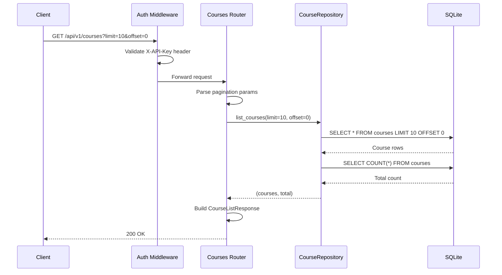
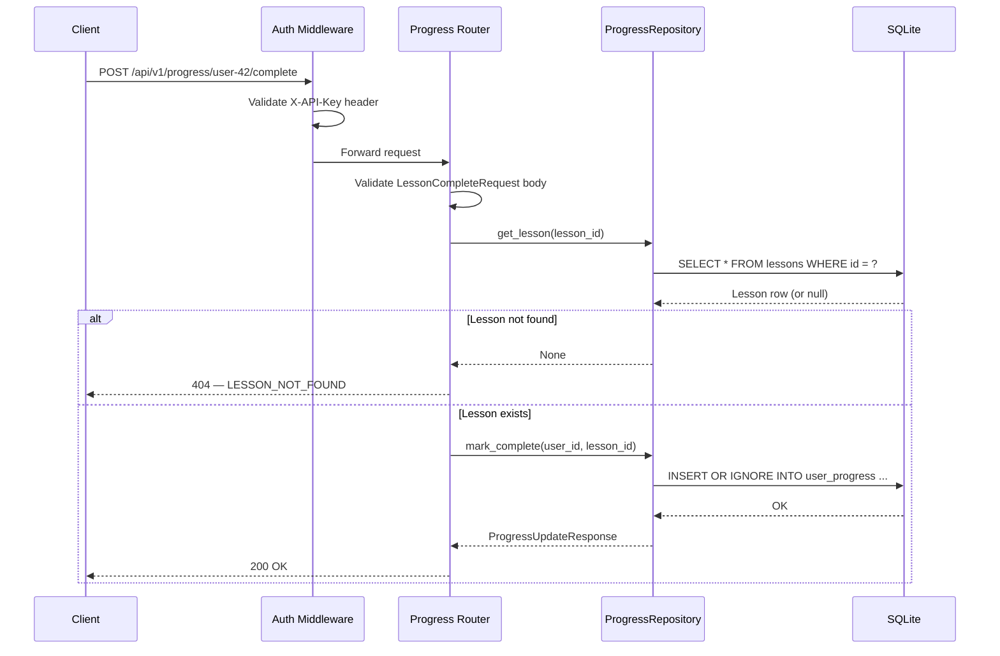
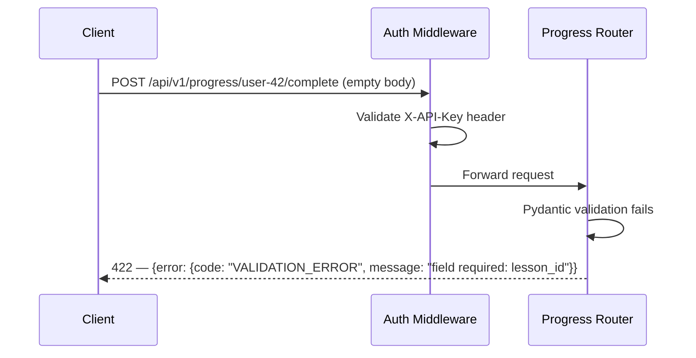

# Low-Level Design (LLD)

| Field                    | Value                                                  |
|--------------------------|--------------------------------------------------------|
| **Title**                | API Layer — Low-Level Design                           |
| **Component**            | API Gateway, Course Catalog Service, Progress Tracking |
| **Version**              | 1.0                                                    |
| **Date**                 | 2026-03-24                                             |
| **Author**               | plan-and-design-agent                                  |
| **HLD Component Ref**    | COMP-001, COMP-003, COMP-004                           |

---

## 1. Component Purpose & Scope

### 1.1 Purpose

The API Layer encompasses the FastAPI application entry point (COMP-001), the Course Catalog Service (COMP-003), and the Progress Tracking service (COMP-004). It defines all REST endpoints under `/api/v1/`, handles request validation, authentication, routing, dependency injection, and response formatting. This LLD specifies every endpoint, Pydantic model, and interaction pattern for the three components.

### 1.2 Scope

- **Responsible for**: HTTP routing, request/response validation, API key authentication, CORS configuration, dependency injection of services and database connections, catalog browsing, progress read/write, health check, pagination, and error response formatting.
- **Not responsible for**: AI content generation (COMP-002), raw database schema management (Data Layer LLD), frontend rendering (COMP-005).
- **Interfaces with**: COMP-002 (Content Service — invoked for AI generation endpoints), Data Layer (SQLite via repository pattern), COMP-005 (serves static files and API responses).

---

## 2. Detailed Design

### 2.1 Module / Class Structure

```
src/
├── main.py                    # FastAPI app factory, lifespan, middleware, static files
├── config.py                  # Settings loaded from environment variables
├── middleware/
│   ├── __init__.py
│   └── auth.py                # API key authentication middleware
├── routes/
│   ├── __init__.py
│   ├── courses.py             # /api/v1/courses endpoints
│   ├── lessons.py             # /api/v1/lessons endpoints
│   ├── quizzes.py             # /api/v1/quiz endpoints
│   ├── progress.py            # /api/v1/progress endpoints
│   └── health.py              # /api/v1/health endpoint
├── models/
│   ├── __init__.py
│   ├── requests.py            # Request body Pydantic models
│   ├── responses.py           # Response body Pydantic models
│   └── errors.py              # Error response models
├── dependencies.py            # FastAPI Depends() providers
└── exceptions.py              # Custom exception classes + handlers
```

### 2.2 Key Classes & Functions

| Class / Function                   | File                        | Description                                                    | Inputs                                    | Outputs                       |
|------------------------------------|-----------------------------|----------------------------------------------------------------|-------------------------------------------|-------------------------------|
| `create_app()`                     | `src/main.py`               | FastAPI app factory; registers routers, middleware, lifespan.  | —                                         | `FastAPI` instance            |
| `lifespan()`                       | `src/main.py`               | Async context manager for DB init, seeding, and cleanup.       | `FastAPI` app                             | Yields app state              |
| `api_key_middleware()`             | `src/middleware/auth.py`    | Validates `X-API-Key` header on all routes except health.      | `Request`, `call_next`                    | `Response` or 401 error       |
| `get_db()`                         | `src/dependencies.py`       | Yields an async database connection for the request lifecycle. | —                                         | `aiosqlite.Connection`        |
| `get_content_service()`            | `src/dependencies.py`       | Provides a configured ContentService instance.                 | —                                         | `ContentService`              |
| `list_courses()`                   | `src/routes/courses.py`     | Handles GET /api/v1/courses with pagination.                   | `limit`, `offset` query params            | `CourseListResponse`          |
| `get_course()`                     | `src/routes/courses.py`     | Handles GET /api/v1/courses/{id}.                              | `id: int` path param                      | `CourseDetailResponse`        |
| `list_lessons()`                   | `src/routes/courses.py`     | Handles GET /api/v1/courses/{id}/lessons.                      | `id: int`, `limit`, `offset`              | `LessonListResponse`          |
| `generate_lesson_content()`        | `src/routes/lessons.py`     | Handles POST /api/v1/lessons/{id}/content.                     | `id: int` path param                      | `LessonContentResponse`       |
| `generate_quiz()`                  | `src/routes/lessons.py`     | Handles POST /api/v1/lessons/{id}/quiz.                        | `id: int` path param                      | `QuizResponse`                |
| `submit_quiz()`                    | `src/routes/quizzes.py`     | Handles POST /api/v1/quiz/{quiz_id}/submit.                    | `quiz_id: int`, `QuizSubmission` body     | `QuizResult`                  |
| `get_progress()`                   | `src/routes/progress.py`    | Handles GET /api/v1/progress/{user_id}.                        | `user_id: str` path param                 | `ProgressResponse`            |
| `mark_lesson_complete()`           | `src/routes/progress.py`    | Handles POST /api/v1/progress/{user_id}/complete.              | `user_id: str`, `LessonCompleteRequest`   | `ProgressUpdateResponse`      |
| `health_check()`                   | `src/routes/health.py`      | Handles GET /api/v1/health.                                    | —                                         | `HealthResponse`              |

### 2.3 Design Patterns Used

- **Dependency injection via FastAPI `Depends()`**: Database connections, service instances, and configuration are injected into route handlers.
- **Router-based modular routing**: Each resource (courses, lessons, quizzes, progress, health) has its own `APIRouter` registered with the main app.
- **Middleware pattern**: API key authentication is implemented as ASGI middleware, applied globally with path-based exclusions.
- **Repository pattern**: Route handlers delegate data access to repository functions (defined in Data Layer), keeping routes thin.
- **Factory pattern**: `create_app()` constructs and configures the FastAPI instance, enabling test configurations.

---

## 3. Data Models

### 3.1 Pydantic Models — Requests

```python
from pydantic import BaseModel, Field
from typing import Optional


class LessonCompleteRequest(BaseModel):
    """Request body to mark a lesson as completed."""
    lesson_id: int = Field(..., gt=0, description="ID of the lesson to mark complete")


class QuizSubmission(BaseModel):
    """Request body for submitting quiz answers."""
    user_id: str = Field(..., min_length=1, max_length=100,
                          description="Opaque user identifier")
    answers: list[str] = Field(..., min_length=1,
                                description="User's selected answers in question order")


class PaginationParams(BaseModel):
    """Query parameters for paginated list endpoints."""
    limit: int = Field(default=20, ge=1, le=100, description="Max results to return")
    offset: int = Field(default=0, ge=0, description="Number of results to skip")
```

### 3.2 Pydantic Models — Responses

```python
from pydantic import BaseModel, Field
from typing import Optional
from datetime import datetime


class CourseResponse(BaseModel):
    """Single course in the catalog."""
    id: int
    title: str
    description: str
    level: str
    total_lessons: int


class CourseListResponse(BaseModel):
    """Paginated list of courses."""
    courses: list[CourseResponse]
    total: int
    limit: int
    offset: int


class LessonSummary(BaseModel):
    """Lesson metadata in a list context."""
    id: int
    title: str
    level: str
    order: int


class CourseDetailResponse(BaseModel):
    """Course details with lesson outline."""
    id: int
    title: str
    description: str
    level: str
    lessons: list[LessonSummary]


class LessonListResponse(BaseModel):
    """Paginated list of lessons for a course."""
    lessons: list[LessonSummary]
    total: int
    limit: int
    offset: int


class LessonContentResponse(BaseModel):
    """AI-generated lesson content."""
    lesson_id: int
    topic: str
    level: str
    content_markdown: str
    generated_at: datetime


class QuizQuestion(BaseModel):
    """A single quiz question."""
    question: str
    options: list[str] = Field(..., min_length=4, max_length=4)
    correct_answer: str
    explanation: str


class QuizResponse(BaseModel):
    """Generated quiz."""
    quiz_id: int
    lesson_id: int
    topic: str
    level: str
    questions: list[QuizQuestion]
    generated_at: datetime


class QuestionResult(BaseModel):
    """Per-question result in a scored quiz."""
    correct: bool
    explanation: str


class QuizResult(BaseModel):
    """Scored quiz result."""
    quiz_id: int
    user_id: str
    score: int
    total: int
    percentage: float
    results: list[QuestionResult]


class CourseProgress(BaseModel):
    """Progress for a single course."""
    course_id: int
    course_title: str
    completed_lessons: int
    total_lessons: int
    quiz_scores: list[float]
    completion_percentage: float


class ProgressResponse(BaseModel):
    """User's progress across all courses."""
    user_id: str
    courses: list[CourseProgress]


class ProgressUpdateResponse(BaseModel):
    """Confirmation of a lesson completion."""
    user_id: str
    lesson_id: int
    status: str = "completed"
    updated_at: datetime


class HealthResponse(BaseModel):
    """Health check response."""
    status: str = Field(..., description="'healthy' or 'degraded'")
    version: str
    database: str = Field(..., description="'connected' or 'disconnected'")


class ErrorDetail(BaseModel):
    """Structured error detail."""
    code: str
    message: str
    details: Optional[str] = None
    retry_after: Optional[int] = None


class ErrorResponse(BaseModel):
    """Standard error response wrapper."""
    error: ErrorDetail
```

---

## 4. API Specifications

### 4.1 Endpoints

| Method | Path                                    | Description                                     | Request Body            | Response Body              | Status Codes              | Auth Required | BRD Ref     |
|--------|-----------------------------------------|-------------------------------------------------|-------------------------|----------------------------|---------------------------|---------------|-------------|
| GET    | `/api/v1/health`                        | System health check                             | —                       | `HealthResponse`           | 200                       | No            | BRD-FR-009  |
| GET    | `/api/v1/courses`                       | List all courses with pagination                | —                       | `CourseListResponse`       | 200                       | Yes           | BRD-FR-001, BRD-FR-014 |
| GET    | `/api/v1/courses/{id}`                  | Get course details with lesson outline          | —                       | `CourseDetailResponse`     | 200, 404                  | Yes           | BRD-FR-002  |
| GET    | `/api/v1/courses/{id}/lessons`          | List lessons for a course with pagination       | —                       | `LessonListResponse`       | 200, 404                  | Yes           | BRD-FR-003, BRD-FR-014 |
| POST   | `/api/v1/lessons/{id}/content`          | Generate AI-powered lesson content              | —                       | `LessonContentResponse`    | 200, 404, 422, 503        | Yes           | BRD-FR-004  |
| POST   | `/api/v1/lessons/{id}/quiz`             | Generate a quiz for a lesson                    | —                       | `QuizResponse`             | 200, 404, 422, 502, 503   | Yes           | BRD-FR-005  |
| POST   | `/api/v1/quiz/{quiz_id}/submit`         | Submit quiz answers                             | `QuizSubmission`        | `QuizResult`               | 200, 404, 422              | Yes           | BRD-FR-006  |
| GET    | `/api/v1/progress/{user_id}`            | Get user progress across all courses            | —                       | `ProgressResponse`         | 200                       | Yes           | BRD-FR-007  |
| POST   | `/api/v1/progress/{user_id}/complete`   | Mark a lesson as completed for a user           | `LessonCompleteRequest` | `ProgressUpdateResponse`   | 200, 404, 422              | Yes           | BRD-FR-008  |

### 4.2 Request / Response Examples

```json
// GET /api/v1/courses?limit=2&offset=0
// 200 OK
{
    "courses": [
        {
            "id": 1,
            "title": "GitHub Actions",
            "description": "Learn to automate CI/CD workflows with GitHub Actions.",
            "level": "beginner",
            "total_lessons": 10
        },
        {
            "id": 2,
            "title": "GitHub Copilot",
            "description": "Master AI-assisted coding with GitHub Copilot.",
            "level": "beginner",
            "total_lessons": 10
        }
    ],
    "total": 3,
    "limit": 2,
    "offset": 0
}
```

```json
// GET /api/v1/courses/1
// 200 OK
{
    "id": 1,
    "title": "GitHub Actions",
    "description": "Learn to automate CI/CD workflows with GitHub Actions.",
    "level": "beginner",
    "lessons": [
        {"id": 1, "title": "Introduction to GitHub Actions", "level": "beginner", "order": 1},
        {"id": 2, "title": "Workflow Syntax and Structure", "level": "beginner", "order": 2},
        {"id": 3, "title": "Working with Actions Marketplace", "level": "beginner", "order": 3}
    ]
}
```

```json
// GET /api/v1/progress/user-42
// 200 OK
{
    "user_id": "user-42",
    "courses": [
        {
            "course_id": 1,
            "course_title": "GitHub Actions",
            "completed_lessons": 3,
            "total_lessons": 10,
            "quiz_scores": [80.0, 100.0],
            "completion_percentage": 30.0
        }
    ]
}
```

```json
// POST /api/v1/progress/user-42/complete
// Request
{
    "lesson_id": 4
}

// 200 OK
{
    "user_id": "user-42",
    "lesson_id": 4,
    "status": "completed",
    "updated_at": "2026-03-24T11:00:00Z"
}
```

```json
// GET /api/v1/health
// 200 OK
{
    "status": "healthy",
    "version": "1.0.0",
    "database": "connected"
}
```

```json
// Any endpoint without valid API key
// 401 Unauthorized
{
    "error": {
        "code": "UNAUTHORIZED",
        "message": "Missing or invalid API key. Provide a valid key in the X-API-Key header.",
        "details": null
    }
}
```

```json
// GET /api/v1/courses/999
// 404 Not Found
{
    "error": {
        "code": "COURSE_NOT_FOUND",
        "message": "Course with ID 999 was not found.",
        "details": null
    }
}
```

---

## 5. Sequence Diagrams

### 5.1 Primary Flow — Course Catalog Browsing



### 5.2 Primary Flow — Mark Lesson Complete



### 5.3 Error Flow — Invalid Input



---

## 6. Error Handling Strategy

### 6.1 Exception Hierarchy

| Exception Class                  | HTTP Status | Description                                                    | Retry? |
|----------------------------------|-------------|----------------------------------------------------------------|--------|
| `CourseNotFoundError`            | 404         | Course ID does not exist in the database.                      | No     |
| `LessonNotFoundError`            | 404         | Lesson ID does not exist in the database.                      | No     |
| `QuizNotFoundError`              | 404         | Quiz ID does not exist in the database.                        | No     |
| `UnauthorizedError`              | 401         | Missing or invalid `X-API-Key` header.                         | No     |
| `ValidationError` (Pydantic)     | 422         | Request body or parameters fail Pydantic validation.           | No     |
| `AIServiceUnavailableError`      | 503         | GitHub Models API unreachable or returned 5xx.                 | Yes    |
| `AIResponseValidationError`      | 502         | AI response failed schema validation after retries.            | Yes    |
| `DatabaseError`                  | 500         | Unexpected database error during operations.                   | No     |

### 6.2 Error Response Format

```json
{
    "error": {
        "code": "COURSE_NOT_FOUND",
        "message": "Course with ID 999 was not found.",
        "details": null
    }
}
```

All errors follow this consistent structure. The `code` field is a machine-readable uppercase string. The `message` field is human-readable. The `details` field provides optional context. For 503 errors, a `retry_after` field (integer seconds) is included.

### 6.3 Logging

- **INFO**: Every API request is logged with method, path, status code, and response time in milliseconds (BRD-NFR-007). Example: `INFO: GET /api/v1/courses 200 45ms`.
- **WARNING**: Authentication failures (401), resource not found (404), and validation errors (422) are logged with request context.
- **ERROR**: Unhandled exceptions and database errors are logged with full stack traces. AI service failures are logged at ERROR level after retry exhaustion.
- **Sensitive data**: API keys (`GITHUB_MODELS_API_KEY`, `API_KEY`) are never logged. User IDs are logged at INFO level for traceability but are opaque identifiers.

---

## 7. Configuration & Environment Variables

| Variable                    | Description                                               | Required | Default                  |
|-----------------------------|-----------------------------------------------------------|----------|--------------------------|
| `API_KEY`                   | Expected value for X-API-Key header authentication        | Yes      | —                        |
| `GITHUB_MODELS_API_KEY`     | Authentication token for the GitHub Models API            | Yes      | —                        |
| `GITHUB_MODELS_ENDPOINT`    | Base URL for the GitHub Models API                        | Yes      | —                        |
| `DATABASE_URL`              | SQLite database file path                                 | No       | `data/learning_platform.db` |
| `CORS_ORIGINS`              | Comma-separated list of allowed CORS origins              | No       | `http://localhost:8000`  |
| `LOG_LEVEL`                 | Logging level (DEBUG, INFO, WARNING, ERROR)               | No       | `INFO`                   |
| `APP_VERSION`               | Application version reported in health check              | No       | `1.0.0`                  |

---

## 8. Dependencies

### 8.1 Internal Dependencies

| Component              | Purpose                                                  | Interface                                                |
|------------------------|----------------------------------------------------------|----------------------------------------------------------|
| COMP-002 (Content Service) | AI content and quiz generation                       | `ContentService.generate_lesson_content()`, `ContentService.generate_quiz()` |
| Data Layer (repositories)  | CRUD operations on courses, lessons, progress, quizzes | Repository functions: `list_courses()`, `get_course()`, `mark_complete()`, etc. |

### 8.2 External Dependencies

| Package / Service       | Version           | Purpose                                                   |
|-------------------------|-------------------|-----------------------------------------------------------|
| fastapi                 | >= 0.110          | Web framework for API routing and validation              |
| uvicorn                 | >= 0.29           | ASGI server for running the FastAPI application           |
| pydantic                | >= 2.6            | Data validation for all request/response schemas          |
| aiosqlite               | >= 0.20           | Async SQLite database access                              |
| httpx                   | >= 0.27           | Used internally by Content Service; also for test client  |

---

## 9. Traceability

| LLD Element                                     | HLD Component  | BRD Requirement(s)                            |
|--------------------------------------------------|----------------|-----------------------------------------------|
| `GET /api/v1/courses`                            | COMP-001, COMP-003 | BRD-FR-001, BRD-FR-014                    |
| `GET /api/v1/courses/{id}`                       | COMP-001, COMP-003 | BRD-FR-002                                |
| `GET /api/v1/courses/{id}/lessons`               | COMP-001, COMP-003 | BRD-FR-003, BRD-FR-014                    |
| `POST /api/v1/lessons/{id}/content`              | COMP-001, COMP-002 | BRD-FR-004, BRD-FR-015, BRD-NFR-002      |
| `POST /api/v1/lessons/{id}/quiz`                 | COMP-001, COMP-002 | BRD-FR-005, BRD-NFR-002                  |
| `POST /api/v1/quiz/{quiz_id}/submit`             | COMP-001, COMP-004 | BRD-FR-006, BRD-FR-011                   |
| `GET /api/v1/progress/{user_id}`                 | COMP-001, COMP-004 | BRD-FR-007                                |
| `POST /api/v1/progress/{user_id}/complete`       | COMP-001, COMP-004 | BRD-FR-008                                |
| `GET /api/v1/health`                             | COMP-001       | BRD-FR-009                                    |
| API key authentication middleware                | COMP-001       | BRD-FR-013, BRD-NFR-004                      |
| Pydantic input validation                        | COMP-001       | BRD-FR-012, BRD-NFR-009                      |
| Request logging middleware                       | COMP-001       | BRD-NFR-007                                   |
| Pagination support (limit/offset)                | COMP-001       | BRD-FR-014                                    |
| Database seeding at startup (`lifespan`)         | COMP-003       | BRD-FR-010                                    |
| `CourseRepository.list_courses()`                | COMP-003       | BRD-FR-001, BRD-NFR-001                      |
| `ProgressRepository.mark_complete()`             | COMP-004       | BRD-FR-008, BRD-NFR-012                      |
| `ProgressRepository.get_progress()`              | COMP-004       | BRD-FR-007, BRD-NFR-006                      |
