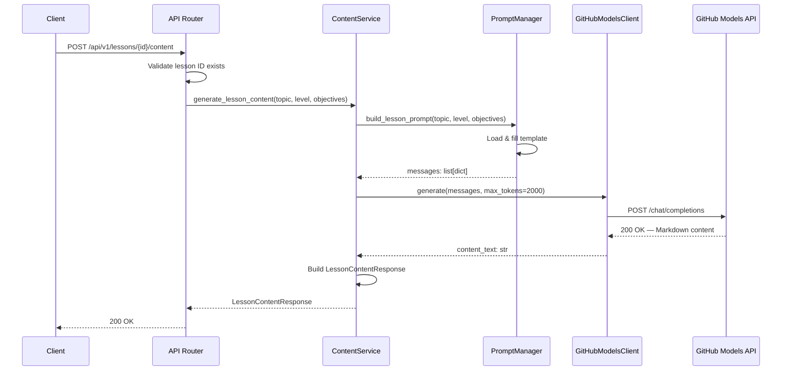
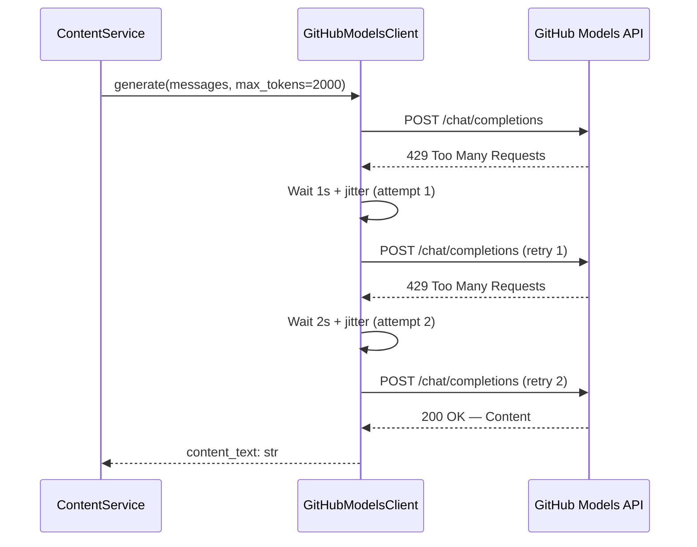
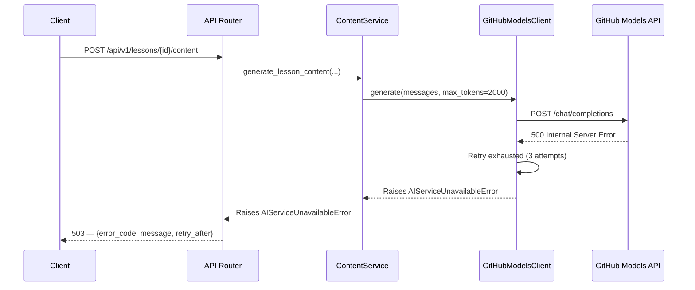
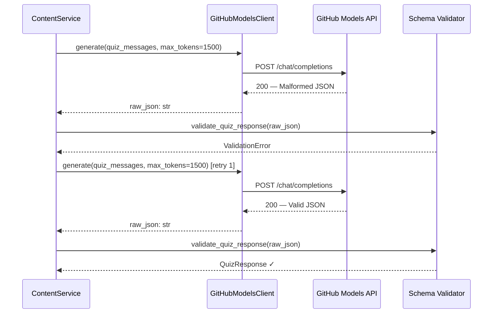

# Low-Level Design (LLD)

| Field                    | Value                                                  |
|--------------------------|--------------------------------------------------------|
| **Title**                | Content Service — Low-Level Design                     |
| **Component**            | Content Service                                        |
| **Version**              | 1.0                                                    |
| **Date**                 | 2026-03-24                                             |
| **Author**               | plan-and-design-agent                                  |
| **HLD Component Ref**    | COMP-002                                               |

---

## 1. Component Purpose & Scope

### 1.1 Purpose

The Content Service is the sole integration point with the GitHub Models API (GPT-4o). It is responsible for constructing AI prompts from file-based templates, sending requests to the GitHub Models endpoint, parsing and validating responses, and returning structured lesson content and quizzes. It satisfies all `BRD-AI-*` requirements and the AI-generation functional requirements (BRD-FR-004, BRD-FR-005, BRD-FR-015).

### 1.2 Scope

- **Responsible for**: AI prompt construction, GitHub Models API communication, response parsing & validation, retry logic with exponential backoff, prompt template management.
- **Not responsible for**: HTTP request routing (COMP-001), course/lesson metadata management (COMP-003), quiz scoring and progress persistence (COMP-004), frontend rendering (COMP-005).
- **Interfaces with**: COMP-001 (receives generation requests via dependency injection), COMP-003 (reads lesson metadata for prompt context), SQLite (stores generated quiz records).

---

## 2. Detailed Design

### 2.1 Module / Class Structure

```
src/
├── services/
│   ├── __init__.py
│   └── content_service.py     # ContentService class — AI integration
├── ai/
│   ├── __init__.py
│   ├── client.py              # GitHubModelsClient — async HTTP client wrapper
│   ├── prompts.py             # PromptManager — template loading & construction
│   └── schemas.py             # AI response validation models
prompts/
├── lesson_content.txt         # Lesson generation prompt template
└── quiz_generation.txt        # Quiz generation prompt template
```

### 2.2 Key Classes & Functions

| Class / Function                        | File                          | Description                                                       | Inputs                                                           | Outputs                        |
|-----------------------------------------|-------------------------------|-------------------------------------------------------------------|------------------------------------------------------------------|--------------------------------|
| `GitHubModelsClient`                    | `src/ai/client.py`           | Async HTTP client wrapping GitHub Models API calls with retry.    | Configured via env vars at init                                  | Instance with `generate()` method |
| `GitHubModelsClient.generate()`         | `src/ai/client.py`           | Sends a chat completion request to GPT-4o; handles retries.       | `messages: list[dict]`, `max_tokens: int`, `temperature: float`  | `str` (raw AI response text)   |
| `PromptManager`                         | `src/ai/prompts.py`          | Loads and caches prompt templates from `prompts/` directory.      | `prompts_dir: Path`                                              | Instance with `build()` methods |
| `PromptManager.build_lesson_prompt()`   | `src/ai/prompts.py`          | Constructs chat messages for lesson content generation.           | `topic: str`, `level: str`, `objectives: list[str]`             | `list[dict]` (chat messages)   |
| `PromptManager.build_quiz_prompt()`     | `src/ai/prompts.py`          | Constructs chat messages for quiz generation.                     | `topic: str`, `level: str`, `num_questions: int`                | `list[dict]` (chat messages)   |
| `ContentService`                        | `src/services/content_service.py` | High-level service orchestrating prompt building and API calls.  | `client: GitHubModelsClient`, `prompt_manager: PromptManager`   | Instance                       |
| `ContentService.generate_lesson_content()` | `src/services/content_service.py` | Generates Markdown lesson content for a given lesson.          | `topic: str`, `level: str`, `objectives: list[str]`             | `LessonContentResponse`        |
| `ContentService.generate_quiz()`        | `src/services/content_service.py` | Generates and validates a quiz for a given lesson.              | `topic: str`, `level: str`, `num_questions: int`                | `QuizResponse`                 |
| `validate_quiz_response()`              | `src/ai/schemas.py`          | Validates raw AI JSON against the quiz Pydantic schema.           | `raw_json: str`                                                  | `QuizResponse` or raises       |

### 2.3 Design Patterns Used

- **Facade pattern**: `ContentService` provides a simple interface hiding the complexity of prompt construction, API communication, and response validation.
- **Strategy pattern**: Prompt templates are externalized, allowing different prompt strategies per topic without code changes.
- **Retry with exponential backoff**: The `GitHubModelsClient` implements a retry decorator for rate-limit and transient error handling.
- **Dependency injection**: `ContentService` receives its dependencies (`GitHubModelsClient`, `PromptManager`) at construction, enabling easy mocking in tests.

---

## 3. Data Models

### 3.1 Pydantic Models

```python
from pydantic import BaseModel, Field
from typing import Optional
from datetime import datetime


class LessonContentRequest(BaseModel):
    """Request context for generating lesson content."""
    topic: str = Field(..., description="Training topic (e.g., 'GitHub Actions')")
    level: str = Field(..., description="Skill level: 'beginner' or 'intermediate'")
    objectives: list[str] = Field(..., min_length=1, max_length=5,
                                   description="Learning objectives for the lesson")


class LessonContentResponse(BaseModel):
    """AI-generated lesson content."""
    lesson_id: int = Field(..., description="ID of the lesson")
    topic: str
    level: str
    content_markdown: str = Field(..., description="Markdown-formatted lesson content")
    generated_at: datetime = Field(default_factory=datetime.utcnow)


class QuizQuestion(BaseModel):
    """A single multiple-choice quiz question."""
    question: str = Field(..., description="The question text")
    options: list[str] = Field(..., min_length=4, max_length=4,
                                description="Exactly 4 answer options")
    correct_answer: str = Field(..., description="The correct option (must be in options)")
    explanation: str = Field(..., description="Explanation of the correct answer")


class QuizResponse(BaseModel):
    """AI-generated quiz with multiple questions."""
    quiz_id: Optional[int] = Field(None, description="Assigned after persistence")
    lesson_id: int
    topic: str
    level: str
    questions: list[QuizQuestion] = Field(..., min_length=3, max_length=5)
    generated_at: datetime = Field(default_factory=datetime.utcnow)


class QuizSubmission(BaseModel):
    """User's quiz answer submission."""
    user_id: str = Field(..., description="Opaque user identifier")
    answers: list[str] = Field(..., min_length=1, description="User's selected answers in order")


class QuizResult(BaseModel):
    """Scored quiz result with per-question feedback."""
    quiz_id: int
    user_id: str
    score: int = Field(..., ge=0, description="Number of correct answers")
    total: int = Field(..., ge=1, description="Total number of questions")
    percentage: float = Field(..., ge=0, le=100)
    results: list[dict] = Field(..., description="Per-question: correct (bool), explanation (str)")


class AIErrorResponse(BaseModel):
    """Structured error when the AI API is unavailable."""
    error_code: str = Field(..., description="Machine-readable error code")
    message: str = Field(..., description="User-friendly error message")
    retry_after: Optional[int] = Field(None, description="Suggested retry delay in seconds")
```

### 3.2 Database Schema (if applicable)

```sql
-- Quizzes generated by the Content Service are persisted for later submission scoring.

CREATE TABLE IF NOT EXISTS quizzes (
    id INTEGER PRIMARY KEY AUTOINCREMENT,
    lesson_id INTEGER NOT NULL,
    questions_json TEXT NOT NULL,  -- JSON serialization of QuizQuestion[]
    generated_at TIMESTAMP DEFAULT CURRENT_TIMESTAMP,
    FOREIGN KEY (lesson_id) REFERENCES lessons(id)
);
```

---

## 4. API Specifications

### 4.1 Endpoints

| Method | Path                              | Description                                       | Request Body          | Response Body              | Status Codes          |
|--------|-----------------------------------|---------------------------------------------------|-----------------------|----------------------------|-----------------------|
| POST   | `/api/v1/lessons/{id}/content`    | Generate AI-powered lesson content                | —                     | `LessonContentResponse`    | 200, 404, 503, 422   |
| POST   | `/api/v1/lessons/{id}/quiz`       | Generate a multiple-choice quiz for a lesson      | —                     | `QuizResponse`             | 200, 404, 502, 503, 422 |
| POST   | `/api/v1/quiz/{quiz_id}/submit`   | Submit quiz answers and receive scored results    | `QuizSubmission`      | `QuizResult`               | 200, 404, 422         |

### 4.2 Request / Response Examples

```json
// POST /api/v1/lessons/5/content
// 200 OK
{
    "lesson_id": 5,
    "topic": "GitHub Actions",
    "level": "beginner",
    "content_markdown": "# Introduction to GitHub Actions Workflows\n\nGitHub Actions allows you to automate...\n\n```yaml\nname: CI\non: [push]\njobs:\n  build:\n    runs-on: ubuntu-latest\n    steps:\n      - uses: actions/checkout@v4\n```\n\n## Key Concepts\n\n...",
    "generated_at": "2026-03-24T10:30:00Z"
}
```

```json
// POST /api/v1/lessons/5/quiz
// 200 OK
{
    "quiz_id": 12,
    "lesson_id": 5,
    "topic": "GitHub Actions",
    "level": "beginner",
    "questions": [
        {
            "question": "What file format is used to define GitHub Actions workflows?",
            "options": ["JSON", "YAML", "TOML", "XML"],
            "correct_answer": "YAML",
            "explanation": "GitHub Actions workflows are defined in YAML files located in the .github/workflows/ directory."
        },
        {
            "question": "Which keyword specifies the events that trigger a workflow?",
            "options": ["trigger", "on", "when", "event"],
            "correct_answer": "on",
            "explanation": "The 'on' keyword in a workflow YAML file specifies which events trigger the workflow."
        },
        {
            "question": "What does 'runs-on' specify in a job definition?",
            "options": ["The programming language", "The runner environment", "The branch name", "The timeout duration"],
            "correct_answer": "The runner environment",
            "explanation": "The 'runs-on' key specifies the type of virtual machine or runner that the job will execute on."
        }
    ],
    "generated_at": "2026-03-24T10:31:00Z"
}
```

```json
// POST /api/v1/quiz/12/submit
// Request
{
    "user_id": "user-42",
    "answers": ["YAML", "trigger", "The runner environment"]
}

// 200 OK
{
    "quiz_id": 12,
    "user_id": "user-42",
    "score": 2,
    "total": 3,
    "percentage": 66.7,
    "results": [
        {"correct": true, "explanation": "GitHub Actions workflows are defined in YAML files located in the .github/workflows/ directory."},
        {"correct": false, "explanation": "The 'on' keyword in a workflow YAML file specifies which events trigger the workflow."},
        {"correct": true, "explanation": "The 'runs-on' key specifies the type of virtual machine or runner that the job will execute on."}
    ]
}
```

```json
// POST /api/v1/lessons/999/content — AI API unavailable
// 503 Service Unavailable
{
    "error": {
        "code": "AI_SERVICE_UNAVAILABLE",
        "message": "The AI content generation service is temporarily unavailable. Please try again later.",
        "details": "GitHub Models API returned HTTP 500",
        "retry_after": 30
    }
}
```

---

## 5. Sequence Diagrams

### 5.1 Primary Flow — Lesson Content Generation



### 5.2 Error Flow — Rate Limit with Retry



### 5.3 Error Flow — AI Unavailable



### 5.4 Quiz Validation Retry Flow



---

## 6. Error Handling Strategy

### 6.1 Exception Hierarchy

| Exception Class                  | HTTP Status | Description                                                      | Retry? |
|----------------------------------|-------------|------------------------------------------------------------------|--------|
| `LessonNotFoundError`            | 404         | The requested lesson ID does not exist in the database.          | No     |
| `QuizNotFoundError`              | 404         | The requested quiz ID does not exist in the database.            | No     |
| `AIServiceUnavailableError`      | 503         | GitHub Models API is unreachable, returned 5xx, or timed out.    | Yes    |
| `AIRateLimitError`               | 503         | GitHub Models API returned HTTP 429 after all retries exhausted. | Yes    |
| `AIResponseValidationError`      | 502         | AI response failed schema validation after all retries.          | Yes    |
| `QuizSubmissionValidationError`  | 422         | User submitted invalid quiz answers (wrong count, invalid format).| No    |

### 6.2 Error Response Format

```json
{
    "error": {
        "code": "AI_SERVICE_UNAVAILABLE",
        "message": "The AI content generation service is temporarily unavailable. Please try again later.",
        "details": "GitHub Models API returned HTTP 500 after 3 retry attempts.",
        "retry_after": 30
    }
}
```

### 6.3 Logging

- **INFO**: Log each content generation request with lesson ID, topic, and level. Log successful AI responses with token count and latency.
- **DEBUG**: Log full prompt messages (excluding API keys), AI response bodies, retry attempts with delay timing (BRD-NFR-008).
- **WARNING**: Log rate-limit responses (429) with retry-after headers. Log malformed AI responses that trigger validation retries.
- **ERROR**: Log final failures after retry exhaustion with full context (request details, error type, attempt count). Never log the `GITHUB_MODELS_API_KEY` value.

---

## 7. Configuration & Environment Variables

| Variable                    | Description                                                 | Required | Default                                      |
|-----------------------------|-------------------------------------------------------------|----------|----------------------------------------------|
| `GITHUB_MODELS_API_KEY`     | Authentication token for the GitHub Models API              | Yes      | —                                            |
| `GITHUB_MODELS_ENDPOINT`    | Base URL for the GitHub Models API                          | Yes      | —                                            |
| `GITHUB_MODELS_MODEL`       | Model name for chat completions                             | No       | `gpt-4o`                                     |
| `AI_REQUEST_TIMEOUT`        | Timeout in seconds for AI API requests                      | No       | `30`                                         |
| `AI_MAX_RETRIES`            | Maximum retry attempts for transient failures               | No       | `3`                                          |
| `AI_INITIAL_BACKOFF`        | Initial backoff delay in seconds for retries                | No       | `1.0`                                        |
| `AI_MAX_BACKOFF`            | Maximum backoff delay in seconds                            | No       | `30.0`                                       |
| `AI_BACKOFF_JITTER`         | Jitter range in milliseconds (±) for backoff                | No       | `500`                                        |
| `LESSON_MAX_TOKENS`         | Max tokens for lesson content generation                    | No       | `2000`                                       |
| `QUIZ_MAX_TOKENS`           | Max tokens for quiz generation                              | No       | `1500`                                       |
| `PROMPTS_DIR`               | Path to the prompt templates directory                      | No       | `prompts/`                                   |

---

## 8. Dependencies

### 8.1 Internal Dependencies

| Component          | Purpose                                                     | Interface                                     |
|--------------------|-------------------------------------------------------------|-----------------------------------------------|
| COMP-001 (API Gateway) | Invokes ContentService methods via dependency injection | `ContentService.generate_lesson_content()`, `ContentService.generate_quiz()` |
| COMP-003 (Course Catalog) | Provides lesson metadata (topic, level, objectives) for prompt construction | Database read of `lessons` table            |
| COMP-004 (Progress Tracking) | Receives quiz_id for scoring and progress persistence | `quizzes` table foreign key references       |

### 8.2 External Dependencies

| Package / Service       | Version           | Purpose                                                   |
|-------------------------|-------------------|-----------------------------------------------------------|
| httpx                   | >= 0.27           | Async HTTP client for GitHub Models API communication     |
| pydantic                | >= 2.6            | Request/response validation and AI response parsing       |
| aiosqlite               | >= 0.20           | Async SQLite access for storing generated quizzes         |
| GitHub Models API       | GPT-4o            | External AI inference service for content generation      |

---

## 9. Traceability

| LLD Element                              | HLD Component | BRD Requirement(s)                                  |
|------------------------------------------|---------------|-----------------------------------------------------|
| `GitHubModelsClient.generate()`          | COMP-002      | BRD-AI-001, BRD-AI-002, BRD-AI-009                 |
| `PromptManager.build_lesson_prompt()`    | COMP-002      | BRD-AI-001, BRD-AI-005, BRD-AI-007, BRD-AI-010    |
| `PromptManager.build_quiz_prompt()`      | COMP-002      | BRD-AI-002, BRD-AI-005, BRD-AI-008, BRD-AI-010    |
| `ContentService.generate_lesson_content()` | COMP-002    | BRD-FR-004, BRD-FR-015, BRD-AI-001, BRD-AI-007    |
| `ContentService.generate_quiz()`         | COMP-002      | BRD-FR-005, BRD-AI-002, BRD-AI-003, BRD-AI-008    |
| `validate_quiz_response()`               | COMP-002      | BRD-AI-003, BRD-AI-008                              |
| Exponential backoff retry logic          | COMP-002      | BRD-AI-004, BRD-NFR-005                             |
| HTTP 503 error handling                  | COMP-002      | BRD-AI-006, BRD-NFR-005                             |
| Prompt template files (`prompts/`)       | COMP-002      | BRD-AI-005, BRD-AI-010                              |
| `POST /api/v1/lessons/{id}/content`      | COMP-002      | BRD-FR-004, BRD-NFR-002                             |
| `POST /api/v1/lessons/{id}/quiz`         | COMP-002      | BRD-FR-005, BRD-NFR-002                             |
| `POST /api/v1/quiz/{quiz_id}/submit`     | COMP-002      | BRD-FR-006, BRD-FR-011                              |
