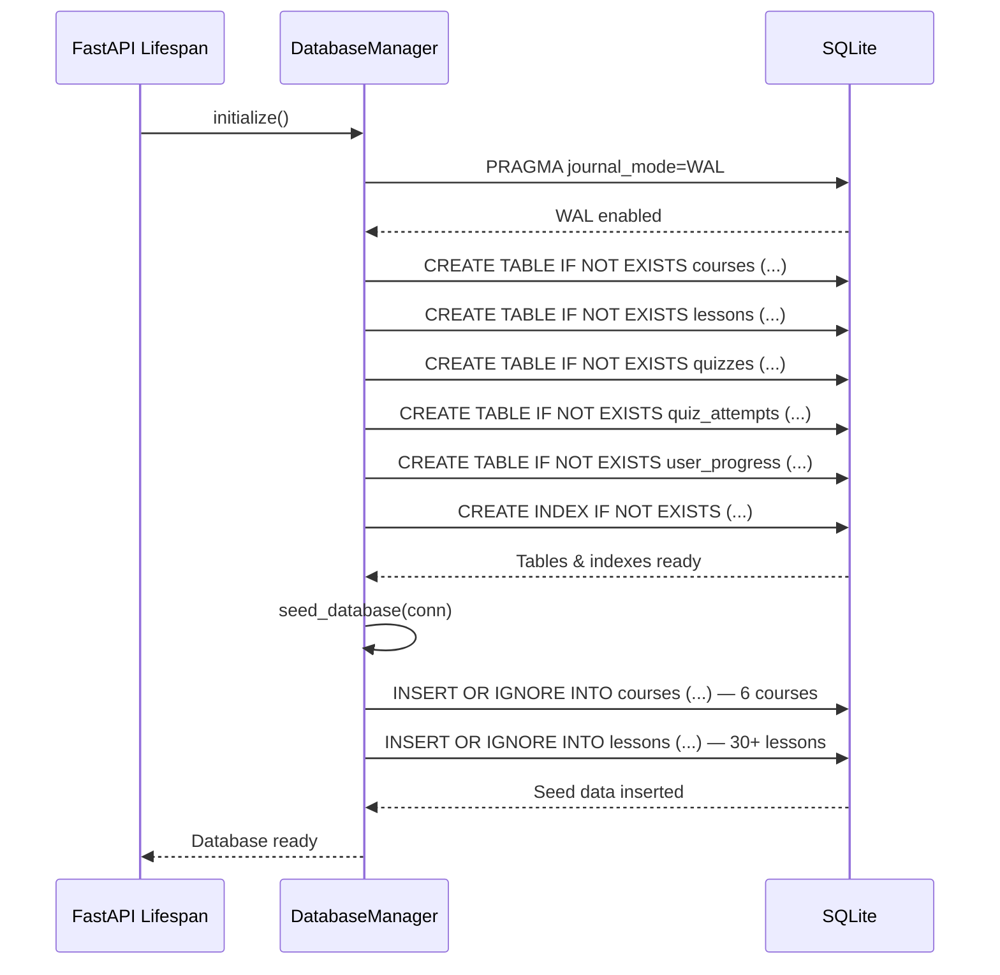
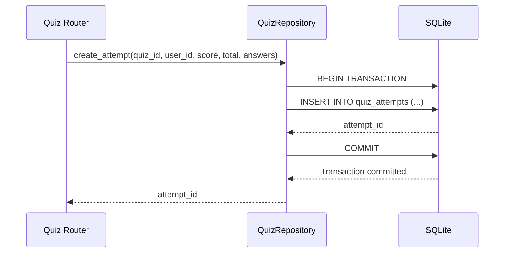
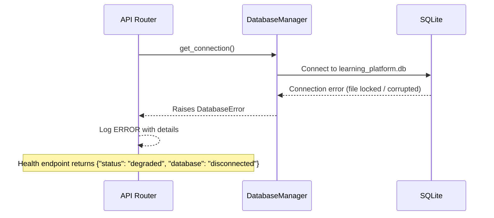

# Low-Level Design (LLD)

| Field                    | Value                                                  |
|--------------------------|--------------------------------------------------------|
| **Title**                | Data Layer — Low-Level Design                          |
| **Component**            | Data Persistence & Repository Layer                    |
| **Version**              | 1.0                                                    |
| **Date**                 | 2026-03-24                                             |
| **Author**               | plan-and-design-agent                                  |
| **HLD Component Ref**    | COMP-004 (primary), COMP-003 (supports)                |

---

## 1. Component Purpose & Scope

### 1.1 Purpose

The Data Layer provides all database persistence for the learning platform. It defines the SQLite schema, Pydantic models that mirror database entities, repository classes for CRUD operations, database initialisation (including table creation and seed data), and connection management. It supports the Course Catalog Service (COMP-003) for course/lesson metadata and the Progress Tracking service (COMP-004) for user progress, quiz scores, and quiz storage.

### 1.2 Scope

- **Responsible for**: SQLite schema definition, table creation, seed data insertion, connection lifecycle management (WAL mode, async access), repository classes for courses, lessons, quizzes, quiz attempts, and user progress.
- **Not responsible for**: HTTP routing or request validation (COMP-001 / API Layer), AI content generation (COMP-002 / Content Service), frontend rendering (COMP-005).
- **Interfaces with**: COMP-001 (provides database connections via dependency injection), COMP-002 (stores generated quizzes), COMP-003 (stores course/lesson catalog), COMP-004 (stores progress and quiz attempts).

---

## 2. Detailed Design

### 2.1 Module / Class Structure

```
src/
├── database/
│   ├── __init__.py
│   ├── connection.py          # Database connection manager & initialization
│   ├── seed.py                # Seed data for courses and lessons
│   └── models.py              # Pydantic models mirroring database entities
├── repositories/
│   ├── __init__.py
│   ├── course_repository.py   # CRUD for courses and lessons
│   ├── quiz_repository.py     # CRUD for quizzes and quiz attempts
│   └── progress_repository.py # CRUD for user progress
data/
└── learning_platform.db       # SQLite database file (created at runtime)
```

### 2.2 Key Classes & Functions

| Class / Function                            | File                                   | Description                                                       | Inputs                                            | Outputs                        |
|---------------------------------------------|----------------------------------------|-------------------------------------------------------------------|---------------------------------------------------|--------------------------------|
| `DatabaseManager`                           | `src/database/connection.py`           | Manages async SQLite connection pool, init, and WAL mode setup.   | `db_path: str`                                    | Instance                       |
| `DatabaseManager.initialize()`              | `src/database/connection.py`           | Creates tables if not exist; enables WAL mode; runs seed data.    | —                                                 | `None`                         |
| `DatabaseManager.get_connection()`          | `src/database/connection.py`           | Yields an async database connection for a request.                | —                                                 | `aiosqlite.Connection`         |
| `seed_database()`                           | `src/database/seed.py`                 | Inserts initial course and lesson records for the 3 topics.       | `conn: aiosqlite.Connection`                      | `None`                         |
| `CourseRepository`                          | `src/repositories/course_repository.py`| Provides CRUD methods for courses and lessons.                    | `conn: aiosqlite.Connection`                      | Instance                       |
| `CourseRepository.list_courses()`           | `src/repositories/course_repository.py`| Lists courses with pagination.                                    | `limit: int`, `offset: int`                       | `tuple[list[CourseRow], int]`  |
| `CourseRepository.get_course()`             | `src/repositories/course_repository.py`| Gets a single course by ID with its lessons.                      | `course_id: int`                                  | `CourseRow | None`             |
| `CourseRepository.list_lessons()`           | `src/repositories/course_repository.py`| Lists lessons for a course, ordered by sequence.                  | `course_id: int`, `limit: int`, `offset: int`     | `tuple[list[LessonRow], int]`  |
| `CourseRepository.get_lesson()`             | `src/repositories/course_repository.py`| Gets a single lesson by ID.                                       | `lesson_id: int`                                  | `LessonRow | None`             |
| `QuizRepository`                            | `src/repositories/quiz_repository.py`  | Provides CRUD methods for quizzes and quiz attempts.              | `conn: aiosqlite.Connection`                      | Instance                       |
| `QuizRepository.create_quiz()`              | `src/repositories/quiz_repository.py`  | Inserts a new quiz record.                                        | `lesson_id: int`, `questions_json: str`           | `int` (quiz_id)                |
| `QuizRepository.get_quiz()`                 | `src/repositories/quiz_repository.py`  | Retrieves a quiz by ID.                                           | `quiz_id: int`                                    | `QuizRow | None`               |
| `QuizRepository.create_attempt()`           | `src/repositories/quiz_repository.py`  | Stores a quiz attempt with score.                                 | `quiz_id`, `user_id`, `score`, `total`, `answers` | `int` (attempt_id)             |
| `ProgressRepository`                        | `src/repositories/progress_repository.py`| Provides CRUD methods for user progress.                        | `conn: aiosqlite.Connection`                      | Instance                       |
| `ProgressRepository.mark_complete()`        | `src/repositories/progress_repository.py`| Marks a lesson as completed for a user (idempotent).            | `user_id: str`, `lesson_id: int`                  | `datetime` (completed_at)      |
| `ProgressRepository.get_progress()`         | `src/repositories/progress_repository.py`| Retrieves progress for a user across all courses.               | `user_id: str`                                    | `list[CourseProgressRow]`      |
| `ProgressRepository.get_quiz_scores()`      | `src/repositories/progress_repository.py`| Retrieves quiz scores for a user in a specific course.          | `user_id: str`, `course_id: int`                  | `list[float]`                  |

### 2.3 Design Patterns Used

- **Repository pattern**: Each database entity group (courses, quizzes, progress) has a dedicated repository class that encapsulates all SQL queries, keeping data access concerns separate from business logic.
- **Unit of Work**: Database connections are scoped to a single request lifecycle via FastAPI dependency injection. Writes within a request share a single transaction.
- **Data Mapper**: Pydantic models in `src/database/models.py` mirror database rows, providing typed access and validation when constructing API responses.
- **Idempotent writes**: `mark_complete()` uses `INSERT OR IGNORE` to ensure duplicate completion requests are safe (BRD-FR-008).

---

## 3. Data Models

### 3.1 Pydantic Models

```python
from pydantic import BaseModel, Field
from typing import Optional
from datetime import datetime


class CourseRow(BaseModel):
    """Mirrors the courses table."""
    id: int
    title: str
    description: str
    topic: str = Field(..., description="One of: 'github-actions', 'github-copilot', 'github-advanced-security'")
    level: str = Field(..., description="'beginner' or 'intermediate'")
    created_at: datetime


class LessonRow(BaseModel):
    """Mirrors the lessons table."""
    id: int
    course_id: int
    title: str
    level: str
    order: int = Field(..., ge=1, description="Sequence order within the course")
    objectives: str = Field(..., description="JSON array of learning objectives")
    created_at: datetime


class QuizRow(BaseModel):
    """Mirrors the quizzes table."""
    id: int
    lesson_id: int
    questions_json: str = Field(..., description="JSON serialization of quiz questions")
    generated_at: datetime


class QuizAttemptRow(BaseModel):
    """Mirrors the quiz_attempts table."""
    id: int
    quiz_id: int
    user_id: str
    score: int
    total: int
    percentage: float
    answers_json: str = Field(..., description="JSON serialization of user's answers")
    attempted_at: datetime


class UserProgressRow(BaseModel):
    """Mirrors the user_progress table."""
    id: int
    user_id: str
    lesson_id: int
    completed_at: datetime


class CourseProgressRow(BaseModel):
    """Computed model for per-course progress (query result, not a direct table mirror)."""
    course_id: int
    course_title: str
    completed_lessons: int
    total_lessons: int
    completion_percentage: float
```

### 3.2 Database Schema

```sql
-- Enable WAL mode for better concurrency (BRD-NFR-006)
PRAGMA journal_mode=WAL;

-- Courses table: stores the 3 training topics at 2 levels each
CREATE TABLE IF NOT EXISTS courses (
    id INTEGER PRIMARY KEY AUTOINCREMENT,
    title TEXT NOT NULL,
    description TEXT NOT NULL,
    topic TEXT NOT NULL CHECK (topic IN ('github-actions', 'github-copilot', 'github-advanced-security')),
    level TEXT NOT NULL CHECK (level IN ('beginner', 'intermediate')),
    created_at TIMESTAMP DEFAULT CURRENT_TIMESTAMP
);

-- Lessons table: ordered lessons within each course
CREATE TABLE IF NOT EXISTS lessons (
    id INTEGER PRIMARY KEY AUTOINCREMENT,
    course_id INTEGER NOT NULL,
    title TEXT NOT NULL,
    level TEXT NOT NULL CHECK (level IN ('beginner', 'intermediate')),
    "order" INTEGER NOT NULL CHECK ("order" >= 1),
    objectives TEXT NOT NULL DEFAULT '[]',  -- JSON array of learning objectives
    created_at TIMESTAMP DEFAULT CURRENT_TIMESTAMP,
    FOREIGN KEY (course_id) REFERENCES courses(id),
    UNIQUE (course_id, "order")
);

-- Quizzes table: AI-generated quizzes stored for scoring
CREATE TABLE IF NOT EXISTS quizzes (
    id INTEGER PRIMARY KEY AUTOINCREMENT,
    lesson_id INTEGER NOT NULL,
    questions_json TEXT NOT NULL,  -- JSON: [{question, options[], correct_answer, explanation}]
    generated_at TIMESTAMP DEFAULT CURRENT_TIMESTAMP,
    FOREIGN KEY (lesson_id) REFERENCES lessons(id)
);

-- Quiz attempts: stores each user's quiz submission and score
CREATE TABLE IF NOT EXISTS quiz_attempts (
    id INTEGER PRIMARY KEY AUTOINCREMENT,
    quiz_id INTEGER NOT NULL,
    user_id TEXT NOT NULL,
    score INTEGER NOT NULL CHECK (score >= 0),
    total INTEGER NOT NULL CHECK (total >= 1),
    percentage REAL NOT NULL CHECK (percentage >= 0 AND percentage <= 100),
    answers_json TEXT NOT NULL,  -- JSON: user's submitted answers
    attempted_at TIMESTAMP DEFAULT CURRENT_TIMESTAMP,
    FOREIGN KEY (quiz_id) REFERENCES quizzes(id)
);

-- User progress: tracks lesson completions per user
CREATE TABLE IF NOT EXISTS user_progress (
    id INTEGER PRIMARY KEY AUTOINCREMENT,
    user_id TEXT NOT NULL,
    lesson_id INTEGER NOT NULL,
    completed_at TIMESTAMP DEFAULT CURRENT_TIMESTAMP,
    FOREIGN KEY (lesson_id) REFERENCES lessons(id),
    UNIQUE (user_id, lesson_id)  -- Idempotent: duplicate completions are ignored
);

-- Indexes for common query patterns
CREATE INDEX IF NOT EXISTS idx_lessons_course_id ON lessons(course_id);
CREATE INDEX IF NOT EXISTS idx_quizzes_lesson_id ON quizzes(lesson_id);
CREATE INDEX IF NOT EXISTS idx_quiz_attempts_user_id ON quiz_attempts(user_id);
CREATE INDEX IF NOT EXISTS idx_quiz_attempts_quiz_id ON quiz_attempts(quiz_id);
CREATE INDEX IF NOT EXISTS idx_user_progress_user_id ON user_progress(user_id);
CREATE INDEX IF NOT EXISTS idx_user_progress_lesson_id ON user_progress(lesson_id);
```

### 3.3 Seed Data

The following data is inserted at application startup (BRD-FR-010). Each topic has 2 courses (beginner + intermediate) with 5-8 lessons each, totalling 6 courses and 30+ lessons.

```python
SEED_COURSES = [
    # GitHub Actions
    {"title": "GitHub Actions — Beginner", "description": "Learn the fundamentals of CI/CD with GitHub Actions.", "topic": "github-actions", "level": "beginner"},
    {"title": "GitHub Actions — Intermediate", "description": "Advanced workflows, matrix builds, and custom actions.", "topic": "github-actions", "level": "intermediate"},
    # GitHub Copilot
    {"title": "GitHub Copilot — Beginner", "description": "Get started with AI-assisted coding using GitHub Copilot.", "topic": "github-copilot", "level": "beginner"},
    {"title": "GitHub Copilot — Intermediate", "description": "Advanced Copilot techniques, prompt engineering, and chat.", "topic": "github-copilot", "level": "intermediate"},
    # GitHub Advanced Security
    {"title": "GitHub Advanced Security — Beginner", "description": "Introduction to code scanning, secret scanning, and Dependabot.", "topic": "github-advanced-security", "level": "beginner"},
    {"title": "GitHub Advanced Security — Intermediate", "description": "Custom CodeQL queries, push protection, and security policies.", "topic": "github-advanced-security", "level": "intermediate"},
]

# Example lesson seeds for GitHub Actions — Beginner (course_id=1)
SEED_LESSONS_ACTIONS_BEGINNER = [
    {"title": "Introduction to GitHub Actions", "order": 1, "objectives": '["Understand what GitHub Actions is", "Identify key use cases for CI/CD automation"]'},
    {"title": "Workflow Syntax and Structure", "order": 2, "objectives": '["Read and write workflow YAML files", "Understand triggers, jobs, and steps"]'},
    {"title": "Working with Actions Marketplace", "order": 3, "objectives": '["Find and use community actions", "Pin actions to specific versions"]'},
    {"title": "Environment Variables and Secrets", "order": 4, "objectives": '["Use environment variables in workflows", "Store and access repository secrets"]'},
    {"title": "Building and Testing Code", "order": 5, "objectives": '["Set up a CI pipeline for a sample project", "Run tests and report results"]'},
]
# ... similar seed data for all 6 courses (30+ lessons total)
```

---

## 4. API Specifications

### 4.1 Endpoints

The Data Layer does not expose HTTP endpoints directly. It is consumed by the API Layer (COMP-001) via repository classes. The following table maps repository methods to the endpoints they support:

| Repository Method                         | Called By Endpoint                           | SQL Operation                              |
|-------------------------------------------|----------------------------------------------|--------------------------------------------|
| `CourseRepository.list_courses()`         | `GET /api/v1/courses`                        | `SELECT ... FROM courses LIMIT ? OFFSET ?` |
| `CourseRepository.get_course()`           | `GET /api/v1/courses/{id}`                   | `SELECT ... FROM courses WHERE id = ?`     |
| `CourseRepository.list_lessons()`         | `GET /api/v1/courses/{id}/lessons`           | `SELECT ... FROM lessons WHERE course_id = ? ORDER BY "order"` |
| `CourseRepository.get_lesson()`           | `POST /api/v1/lessons/{id}/content`, `POST /api/v1/lessons/{id}/quiz` | `SELECT ... FROM lessons WHERE id = ?` |
| `QuizRepository.create_quiz()`            | `POST /api/v1/lessons/{id}/quiz`             | `INSERT INTO quizzes ...`                  |
| `QuizRepository.get_quiz()`              | `POST /api/v1/quiz/{quiz_id}/submit`         | `SELECT ... FROM quizzes WHERE id = ?`     |
| `QuizRepository.create_attempt()`         | `POST /api/v1/quiz/{quiz_id}/submit`         | `INSERT INTO quiz_attempts ...`            |
| `ProgressRepository.mark_complete()`      | `POST /api/v1/progress/{user_id}/complete`   | `INSERT OR IGNORE INTO user_progress ...`  |
| `ProgressRepository.get_progress()`       | `GET /api/v1/progress/{user_id}`             | Aggregation query across courses, lessons, progress |
| `ProgressRepository.get_quiz_scores()`    | `GET /api/v1/progress/{user_id}`             | `SELECT percentage FROM quiz_attempts WHERE user_id = ? AND quiz_id IN (...)` |

### 4.2 Key SQL Queries

```sql
-- List courses with pagination
SELECT id, title, description, topic, level, created_at
FROM courses
ORDER BY id
LIMIT :limit OFFSET :offset;

-- Count total courses
SELECT COUNT(*) FROM courses;

-- Get course with lesson count
SELECT c.*, COUNT(l.id) as total_lessons
FROM courses c LEFT JOIN lessons l ON l.course_id = c.id
WHERE c.id = :course_id
GROUP BY c.id;

-- List lessons for a course, ordered by sequence
SELECT id, course_id, title, level, "order", objectives, created_at
FROM lessons
WHERE course_id = :course_id
ORDER BY "order"
LIMIT :limit OFFSET :offset;

-- Get user progress across all courses (aggregated)
SELECT
    c.id as course_id,
    c.title as course_title,
    COUNT(DISTINCT up.lesson_id) as completed_lessons,
    COUNT(DISTINCT l.id) as total_lessons,
    ROUND(COUNT(DISTINCT up.lesson_id) * 100.0 / COUNT(DISTINCT l.id), 1) as completion_percentage
FROM courses c
JOIN lessons l ON l.course_id = c.id
LEFT JOIN user_progress up ON up.lesson_id = l.id AND up.user_id = :user_id
GROUP BY c.id, c.title;

-- Mark lesson complete (idempotent)
INSERT OR IGNORE INTO user_progress (user_id, lesson_id)
VALUES (:user_id, :lesson_id);

-- Store quiz attempt atomically
BEGIN TRANSACTION;
INSERT INTO quiz_attempts (quiz_id, user_id, score, total, percentage, answers_json)
VALUES (:quiz_id, :user_id, :score, :total, :percentage, :answers_json);
COMMIT;
```

---

## 5. Sequence Diagrams

### 5.1 Primary Flow — Database Initialization



### 5.2 Primary Flow — Quiz Attempt Storage



### 5.3 Error Flow — Database Unreachable



---

## 6. Error Handling Strategy

### 6.1 Exception Hierarchy

| Exception Class              | HTTP Status | Description                                               | Retry? |
|------------------------------|-------------|-----------------------------------------------------------|--------|
| `DatabaseError`              | 500         | Unexpected SQLite error (connection, query, corruption).  | No     |
| `RecordNotFoundError`        | 404         | Requested row does not exist (course, lesson, quiz).      | No     |
| `DataIntegrityError`         | 500         | Foreign key or constraint violation.                      | No     |
| `TransactionError`           | 500         | Transaction commit failed; changes rolled back.           | Yes    |

### 6.2 Error Response Format

```json
{
    "error": {
        "code": "DATABASE_ERROR",
        "message": "An internal database error occurred. Please try again.",
        "details": "Transaction rolled back due to constraint violation."
    }
}
```

### 6.3 Logging

- **INFO**: Log database initialization success, seed data counts, connection open/close events.
- **DEBUG**: Log individual SQL queries with parameters (excluding any sensitive data) and execution time.
- **WARNING**: Log connection pool exhaustion warnings, slow queries (> 500ms).
- **ERROR**: Log all database exceptions with full context (query, parameters, error message). Log transaction rollbacks with affected table names.

---

## 7. Configuration & Environment Variables

| Variable                    | Description                                          | Required | Default                           |
|-----------------------------|------------------------------------------------------|----------|-----------------------------------|
| `DATABASE_URL`              | Path to the SQLite database file                     | No       | `data/learning_platform.db`       |
| `DATABASE_ECHO`             | Enable SQL query logging at DEBUG level              | No       | `false`                           |
| `DATABASE_POOL_SIZE`        | Max number of concurrent connections                 | No       | `5`                               |

---

## 8. Dependencies

### 8.1 Internal Dependencies

| Component              | Purpose                                                | Interface                                     |
|------------------------|--------------------------------------------------------|-----------------------------------------------|
| COMP-001 (API Gateway) | Provides database connection via dependency injection  | `get_db()` yields `aiosqlite.Connection`      |
| COMP-002 (Content Service) | Calls `QuizRepository.create_quiz()` to persist quizzes | Repository method call                     |
| COMP-003 (Course Catalog) | Uses `CourseRepository` for catalog queries          | Repository method calls                       |
| COMP-004 (Progress Tracking) | Uses `ProgressRepository` and `QuizRepository`    | Repository method calls                       |

### 8.2 External Dependencies

| Package / Service       | Version           | Purpose                                                   |
|-------------------------|-------------------|-----------------------------------------------------------|
| aiosqlite               | >= 0.20           | Async SQLite database access                              |
| pydantic                | >= 2.6            | Data models mirroring database entities                   |
| sqlite3                 | Bundled (Python)  | Underlying database engine                                |

---

## 9. Traceability

| LLD Element                                  | HLD Component  | BRD Requirement(s)                              |
|----------------------------------------------|----------------|-------------------------------------------------|
| `courses` table schema                       | COMP-003       | BRD-FR-001, BRD-FR-002, BRD-FR-010             |
| `lessons` table schema                       | COMP-003       | BRD-FR-003, BRD-FR-010                          |
| `quizzes` table schema                       | COMP-002       | BRD-FR-005, BRD-AI-002, BRD-AI-003             |
| `quiz_attempts` table schema                 | COMP-004       | BRD-FR-006, BRD-FR-011, BRD-NFR-012            |
| `user_progress` table schema                 | COMP-004       | BRD-FR-007, BRD-FR-008, BRD-NFR-012            |
| WAL mode pragma                              | COMP-004       | BRD-NFR-006                                      |
| `seed_database()` function                   | COMP-003       | BRD-FR-010                                       |
| `CourseRepository.list_courses()`            | COMP-003       | BRD-FR-001, BRD-FR-014                           |
| `CourseRepository.get_course()`              | COMP-003       | BRD-FR-002                                       |
| `CourseRepository.list_lessons()`            | COMP-003       | BRD-FR-003, BRD-FR-014                           |
| `QuizRepository.create_quiz()`               | COMP-002       | BRD-FR-005                                       |
| `QuizRepository.create_attempt()`            | COMP-004       | BRD-FR-006, BRD-FR-011, BRD-NFR-012            |
| `ProgressRepository.mark_complete()`         | COMP-004       | BRD-FR-008, BRD-NFR-012                         |
| `ProgressRepository.get_progress()`          | COMP-004       | BRD-FR-007                                       |
| Idempotent `INSERT OR IGNORE` pattern        | COMP-004       | BRD-FR-008                                       |
| Transaction management (`BEGIN`/`COMMIT`)    | COMP-004       | BRD-NFR-006, BRD-NFR-012                        |
| Database indexes                             | COMP-003, COMP-004 | BRD-NFR-001                                 |
